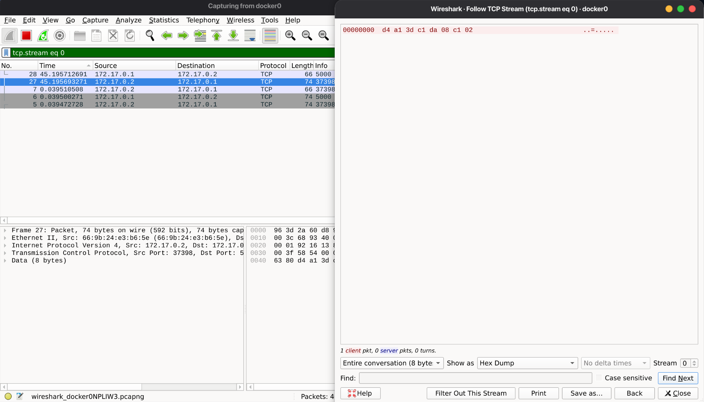

# Keamanan-Informasi-cipher

|    NRP     |        Nama         |
| :--------: | :-----------------: |
| 5025241177 | Hosea Felix Sanjaya |

Simulasi komunikasi dua arah antara sender dan receiver lewat socket TCP. Setiap pesan dienkripsi dengan DES sebelum dikirim dan didekripsi setelah diterima.

## File

| File          | Isi                                                        |
| ------------- | ---------------------------------------------------------- |
| `cipher.py`   | Implementasi DES: fungsi `encrypt` dan `decrypt`           |
| `receiver.py` | Server. Menunggu koneksi di port 5000, menerima lalu membalas |
| `sender.py`   | Client. Terhubung ke receiver, mengirim lalu menerima balasan |

## Cara kerja cipher

`cipher.py` memakai DES (Data Encryption Standard) dengan key `G30SPKI1` (8 karakter, 64 bit).

Enkripsi:

1. Pesan diubah ke byte, lalu diberi padding agar panjangnya kelipatan 8 byte.
2. Dari key dibuat 16 subkey (tabel PC-1, geser kiri, tabel PC-2).
3. Setiap blok 64 bit diproses:
   - Initial Permutation (IP)
   - 16 round Feistel: bagian kanan diperlebar (tabel E), di-XOR dengan subkey, masuk 8 S-Box, diacak (tabel P), lalu di-XOR dengan bagian kiri
   - Tukar kiri-kanan, lalu Final Permutation (FP)

Dekripsi memakai proses yang sama dengan urutan subkey dibalik, lalu padding dibuang.

Ciphertext ditampilkan dalam format hex.

## Menjalankan

Receiver berjalan di laptop, sender berjalan di Docker container sebagai perangkat kedua.

1. Terminal 1, jalankan receiver:
   ```bash
   python3 receiver.py
   ```
2. Terminal 2, masuk ke folder project lalu jalankan sender di Docker:
   ```bash
   sudo docker run -it --rm -v "$PWD":/app -w /app python:3-slim python sender.py
   ```
3. Sender dan receiver bergantian mengirim pesan. Hentikan dengan `Ctrl+C`.

Untuk dua komputer berbeda, isi `IP_RECEIVER` dengan IP komputer receiver dan jalankan `python3 sender.py` di komputer sender. Kedua komputer harus berada di jaringan yang sama.

## Dokumentasi


